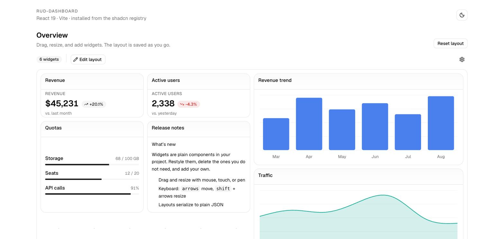
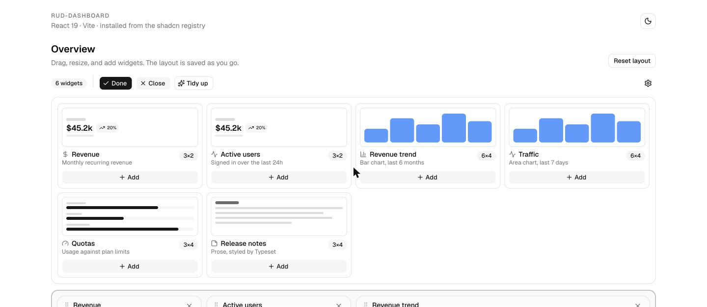
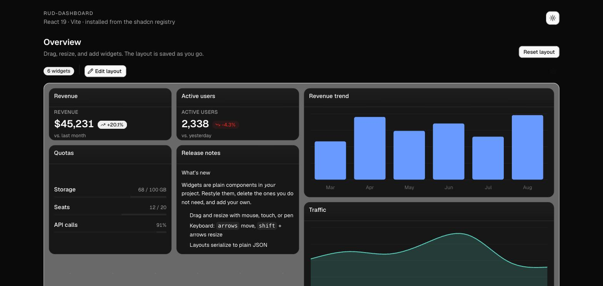

# rud-dashboard

A draggable, resizable dashboard grid for React and Preact that looks like **your** app on arrival.

The UI is distributed as source through a [shadcn registry](https://ui.shadcn.com/docs/registry), so it uses your `Button`, your `Card`, your theme tokens, and your `cn()`. Nothing ships CSS. There is no Tailwind preset, no `content` glob pointing into `node_modules`, and no stylesheet to import.



## Install

Two commands, from any project that already has [shadcn](https://ui.shadcn.com) set up:

```bash
npx shadcn@latest registry add @rud=https://raw.githubusercontent.com/ofirrubin/react-dashboard-builder/main/public/r/{name}.json
npx shadcn@latest add @rud/dashboard-demo
```

That installs 22 files: the grid, four widget bodies, the optional theme, and a
complete demo page. Then render it:

```tsx
import { DashboardDemo } from "@/components/dashboard-demo"

export default function Page() {
  return <div className="p-6"><DashboardDemo /></div>
}
```

<details>
<summary>Starting from nothing?</summary>

```bash
npx shadcn@latest init --name my-app --template vite --base radix --defaults
cd my-app
npx shadcn@latest registry add @rud=https://raw.githubusercontent.com/ofirrubin/react-dashboard-builder/main/public/r/{name}.json
npx shadcn@latest add @rud/dashboard-demo
```
</details>

The registry pulls the shadcn primitives each item needs (`card`, `button`,
`popover`, `empty`, `chart`, …) through `registryDependencies`, and npm-installs
the headless engine. Nothing else to wire up.

> `raw.githubusercontent.com` is served from a CDN with a short cache, so a
> freshly pushed registry change can take a few minutes to appear.

### What each item installs

| Item | Contents |
| --- | --- |
| `@rud/dashboard` | The grid: `Dashboard`, `DashboardItem`, `DashboardToolbar`, `DashboardWidgetBar`, `useDashboard` |
| `@rud/dashboard-widgets` | Four widget bodies + their palette miniatures: stat, progress, chart, Typeset prose |
| `@rud/dashboard-theme` | Optional polish — layered depth, drag feedback, prose rhythm. Merged into your CSS automatically |
| `@rud/dashboard-demo` | A complete working page wiring all of the above together |

Install only what you want:

```bash
npx shadcn@latest add @rud/dashboard            # just the grid
npx shadcn@latest add @rud/dashboard-widgets    # + ready-made widget bodies
```

## Usage

One object describes every widget. `type` is the key stored in the saved layout.

```tsx
import { Dashboard } from "@/components/dashboard/dashboard"
import type { WidgetCatalog } from "@/components/dashboard/dashboard"

const widgets: WidgetCatalog = {
  revenue: {
    title: "Revenue",
    description: "Monthly recurring revenue",
    icon: DollarSignIcon,
    defaultSize: { w: 3, h: 2 },
    preview: () => <StatWidgetPreview />,   // miniature in the add-widget bar
    render: () => <RevenueCard />,
  },
}

<Dashboard widgets={widgets} defaultLayout={layout} onLayoutChange={save} />
```

`layout` is plain JSON — persist it in `localStorage`, a database, or wherever
you like:

```json
[{ "id": "1", "type": "revenue", "title": "Revenue", "x": 0, "y": 0, "w": 3, "h": 2 }]
```

`Dashboard` is controlled or uncontrolled, like a native input: pass `layout` +
`onLayoutChange`, or just `defaultLayout`. Same for `editing` / `defaultEditing`.

### A 12-column grid

Spans are grid cells on a **fixed 12-column grid with fluid column width**, so
`w: 6` is always half the dashboard, on every screen. Columns are responsive by
default — `{ 0: 1, 640: 6, 1024: 12 }` — and the geometry is overridable:

```tsx
<Dashboard widgets={widgets} grid={{ columns: 24, rowHeight: 48, gap: 8 }} />
```

### Adding widgets

`Add widget` expands a bar in place rather than opening a popover, so the
dashboard stays visible while you choose. Each entry shows a live miniature from
`WidgetDefinition.preview`, which animates in as the bar opens and then rests at
its real values.



### Drag feel

A dragged card lifts and follows the pointer exactly while you are moving it —
no transition to lag behind, no stepping between cells. The moment the pointer
slows or stops, it eases into the slot the drop indicator is showing. Snapping on
every pointer move is what makes a grid feel like it is catching on something.
Tune with `FREE_MOVE_SPEED` and `SETTLE_DELAY_MS` in `use-dashboard.ts`.

Gestures use pointer events, so mouse, touch, and pen all work from one path.

### Limiting the height

By default the canvas grows with its content. Cap it with `maxHeight`, and pick
what the cap means:

```tsx
// Stop at 600px and scroll. Widgets may sit below the fold.
<Dashboard widgets={w} maxHeight={600} />

// Stop at 600px and limit the grid to the rows that fit, so nothing can be
// placed out of sight. Drag, the drop indicator, and keyboard nudges all obey it.
<Dashboard widgets={w} maxHeight={600} maxHeightMode="clamp" />
```

The toolbar's "Fixed height" switch turns the cap on and off; without `maxHeight`
it falls back to 2.5x the minimum height. `useDashboard` also returns `scrolls`,
true only when content actually exceeds the cap — a capped canvas that happens to
fit shows no scrollbar.

### Custom toolbar

```tsx
<Dashboard widgets={w} toolbarActions={<Button size="sm">Export</Button>} />  // append
<Dashboard widgets={w} toolbar={false} />                                     // none
<Dashboard widgets={w} toolbar={(api) => (                                    // replace
  <MyBar
    editing={api.isEditing} onEditingChange={api.setEditing}
    onAdd={api.addWidget}   onTidy={api.tidy}
    count={api.items.length} save={api.save} load={api.load}
  />
)} />
```

`api` is the full `useDashboard` return, so a custom bar loses nothing. Replace
the empty state with `emptyState`.

### Keyboard

Widgets are focusable in edit mode. Arrows move; `shift` + arrows resize.

### Dark mode

Every colour is a theme token, so light and dark both follow the host app with
no `dark:` overrides in any component.



## The engine

The layout math lives in a separate, headless npm package — pure TypeScript,
**zero dependencies**, no React, no DOM, no CSS:

```bash
npm install rud-dashboard
```

```ts
import { packItems, resolveCollisions, measureGrid, parseLayout } from "rud-dashboard"
```

Grid geometry, deterministic collision resolution, repacking, reflow across
column counts, and layout (de)serialisation with validation. The registry
components install it automatically. Use it directly to build your own renderer.

## Preact

The same registry sources run on Preact unchanged — no separate entry point, no
`/preact` import path, no build flags. Alias `react` to `preact/compat`:

```ts
// vite.config.ts
import preact from "@preact/preset-vite"
export default defineConfig({ plugins: [preact(), tailwindcss()] })
```

```jsonc
// tsconfig.app.json — mirror the bundler alias so types match the runtime.
// Both candidate paths are listed because a package manager may hoist `preact`
// to the workspace root; if the mapping resolves to nothing, TS silently falls
// back to a hoisted @types/react and every component fails with a confusing
// "Element is not assignable to ReactNode".
"paths": {
  "@/*": ["./src/*"],
  "react": ["./node_modules/preact/compat/", "../../node_modules/preact/compat/"],
  "react-dom": ["./node_modules/preact/compat/", "../../node_modules/preact/compat/"],
  "react-dom/client": ["./node_modules/preact/compat/client", "../../node_modules/preact/compat/client"],
  "react/jsx-runtime": ["./node_modules/preact/jsx-runtime", "../../node_modules/preact/jsx-runtime"]
}
```

Two small notes, both already handled in `examples/preact-vite`:

- shadcn's `ui/button.tsx` needs `as React.ElementType` on the `Slot.Root` /
  `"button"` union, because `preact/compat` treats refs as invariant.
- shadcn's `ui/chart.tsx` needs `color?: string` declared explicitly on
  `ChartTooltipContent`.

Both are one-line edits in files you own. The dashboard components need nothing.

## Development

```bash
npm install
npm run build           # engine + registry JSON
npm test                # 71 engine tests

npm run example:react   # examples/react-vite   — React 19
npm run example:preact  # examples/preact-vite  — Preact via preact/compat
```

The two examples share byte-identical component sources; only their Vite/TS
config and the two shadcn tweaks above differ.

To exercise the registry install path against local changes:

```bash
npm run registry:serve  # builds, then serves public/r on :4499
# then, in a scratch project:
npx shadcn@latest registry add @rud=http://localhost:4499/r/{name}.json
npx shadcn@latest add @rud/dashboard-demo
```

## Repository layout

```
packages/core/      rud-dashboard — headless engine (published to npm)
registry/rud/       source distributed via the shadcn registry
registry.json       registry manifest
public/r/           built registry JSON (shadcn build) — committed, it is what the URL serves
examples/           react-vite, preact-vite
docs/media/         screenshots used above
```

`public/r/*.json` is generated by `npm run build` and **must be committed** — it
is what the install URL serves.

## Upgrading from 0.1.x

0.1.x shipped a compiled component library that injected its own full Tailwind
build (including preflight, plus rules targeting the host's `body` and `#root`),
vendored private copies of `Button` and `Tooltip`, and hardcoded blue/grey
colours that ignored its own tokens. Theming it was not really possible, and
setup meant a Tailwind preset, a `node_modules` content glob, a `@config`
back-reference, and a stylesheet import.

That approach is gone:

- **`rud-dashboard` on npm is now the headless engine only.** If you imported
  `Dashboard` from it, get the component from the registry instead.
- **`rud-dashboard/preact`, `rud-dashboard/tailwind.preset`, and
  `rud-dashboard/styles.css` no longer exist.** None of them have a replacement,
  because none of them are needed.
- **Saved layouts need remapping.** 0.1.x spans were fixed 40px cells with a
  column count derived from container width; 0.2 spans are cells on a fixed
  12-column grid. `original{X,Y,W,H}` is now `anchor{X,Y,W,H}`. Run stored
  payloads through `parseLayout` — it drops malformed items and reports what it
  changed rather than throwing.

Some concrete bugs fixed along the way:

- Rendering placed cells at a 56px pitch while pointer hit-testing used 48px, so
  a widget drawn in column 3 was read back as column 4 and items drifted a full
  column every ~3 cells.
- Touch drag never worked: `onTouchStart` began a gesture but only
  `mousemove`/`mouseup` were listened for, so it started and then neither moved
  nor committed.
- `DashboardToolbar` was entirely `// @ts-nocheck`, and `src/global.preact.d.ts`
  declared `namespace React { type ReactNode = any }` globally — which could ship
  in the published `.d.ts` and silently turn `ReactNode` into `any` across a
  consumer's whole project.
- `Button` accepted `asChild` and ignored it (no Radix Slot), so every
  `<TooltipTrigger asChild>` in the toolbar was a no-op.
- The tested `gridMath.ts` was dead code; `Dashboard.tsx` redefined the same
  collision functions inline.
- There was no keyboard path to move or resize a widget at all.

## License

MIT
